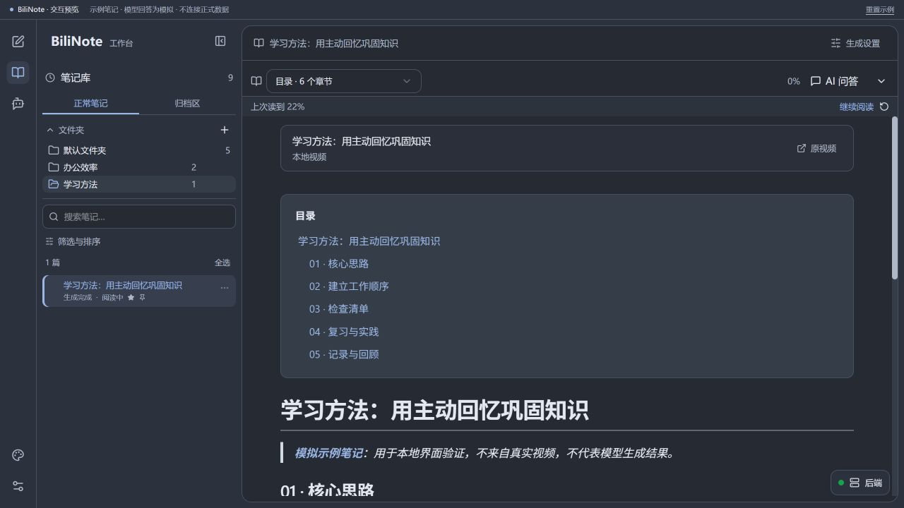
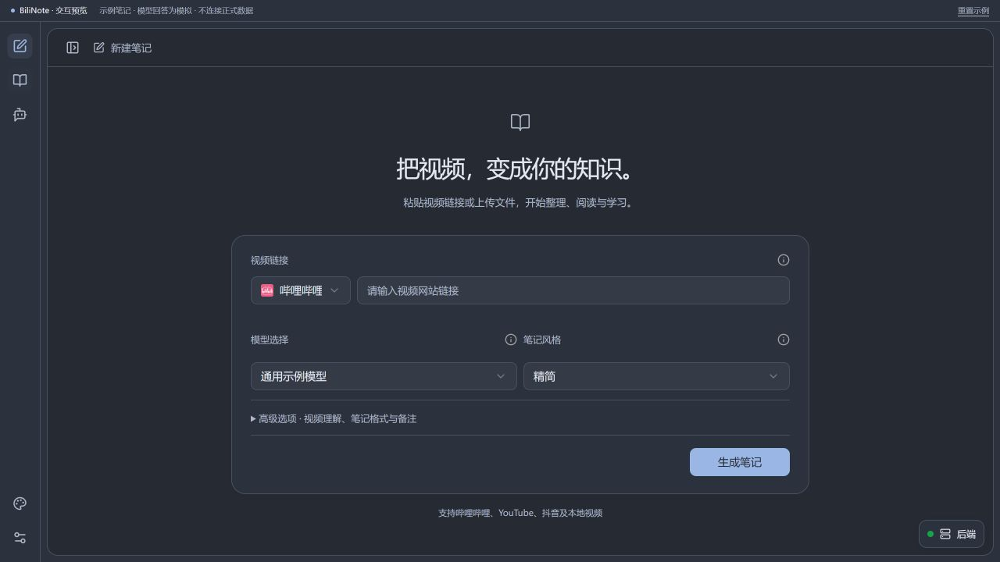
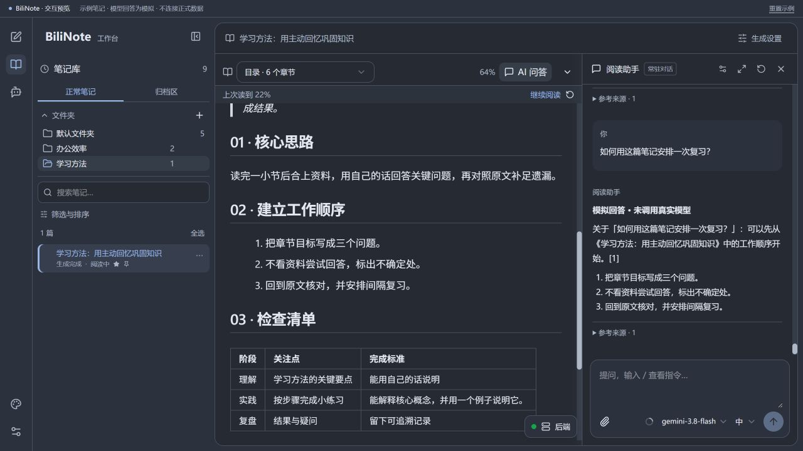
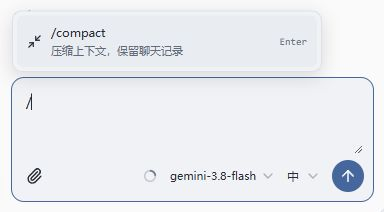
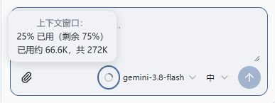
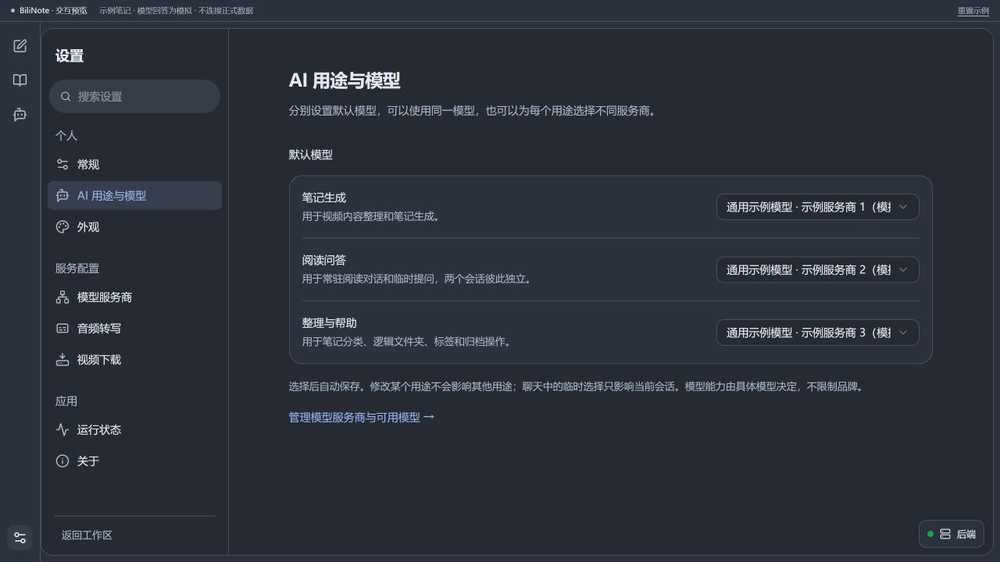
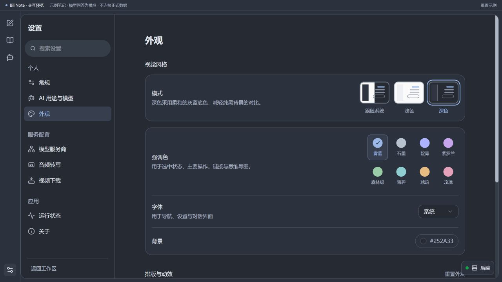

# BiliNote · 升级版

**集视频笔记、知识管理与 AI 辅助阅读于一体的学习工作台。**

本次升级围绕笔记生成后的阅读、问答与整理流程展开，重新设计工作区布局，完善笔记库管理，新增引用式阅读助手、计划式整理助手和长对话上下文管理，并统一模型配置与外观设置。

## 升级概览

| 模块 | 主要升级 |
| --- | --- |
| 工作区 | 统一图标导航，可折叠笔记栏，独立的新建与阅读视图 |
| 笔记管理 | 文件夹、搜索筛选、收藏置顶、标签备注、学习状态与批量操作 |
| 阅读体验 | 章节导航、阅读位置记忆、继续阅读、可折叠工具栏与专注模式 |
| 阅读助手 | 选段引用、多段引用、常驻对话、临时聊天及图片与文本附件 |
| 整理助手 | 自然语言提出需求，生成可审阅计划，确认执行与操作撤销 |
| 上下文管理 | 用量提示、自动压缩、`/compact` 手动压缩与原始记录保留 |
| 模型配置 | 按生成、阅读、整理用途设置默认模型，支持会话级模型与思考档位选择 |
| 界面外观 | 深浅主题、跟随系统、8 种强调色、字体字号与动态效果设置 |

## 工作区与笔记生成

采用“导航栏、笔记侧栏、内容区”的布局，将新建与阅读拆分为独立视图。笔记侧栏可按需展开，减少常驻控件对正文空间的占用。

新建界面集中呈现视频来源、模型和笔记风格，视频理解、输出格式与补充备注归入高级选项。新建与阅读分别保留侧栏偏好，切换设置后可恢复工作区和未提交草稿。

## 笔记库与阅读体验

围绕内容组织、检索和学习进度完善笔记管理：

- **分类与检索**：通过文件夹、标签、搜索、组合筛选和排序组织笔记。
- **重点管理**：支持收藏、置顶、备注及批量操作，提供归档与恢复入口。
- **学习状态**：以“待读、阅读中、已读完”记录学习进度。
- **连续阅读**：保存阅读位置，支持继续阅读和章节跳转。
- **阅读布局**：提供字号、阅读宽度、专注模式与工具栏折叠设置。

正文目录与顶部章节导航采用统一跳转目标；原文参照、思维导图、复制和导出功能整合在阅读工具区。

*工作台总览图展示了笔记分类、学习状态、章节目录与继续阅读入口。*

## AI 阅读助手

阅读助手与笔记正文并排显示，支持基于当前内容进行解释、要点提取和复习问答。选中文字或多个段落后，可直接作为引用加入对话，并保留来源信息，便于核对原文。

| 能力 | 说明 |
| --- | --- |
| 常驻对话 | 保留阅读讨论，支持连续追问 |
| 临时聊天 | 独立处理临时问题，可将消息、附件和草稿转入常驻对话 |
| 引用与附件 | 支持选段、多段引用，以及图片、TXT、Markdown 附件的添加、预览与移除 |
| 会话设置 | 在输入区集中选择模型与兼容的思考档位 |

图片理解能力取决于所选模型。

## AI 整理助手

支持通过自然语言描述笔记整理需求，将操作转化为包含目标位置、受影响笔记和具体变更的整理计划。

**提出需求 → 审阅计划 → 确认执行 → 查看结果或撤销**

例如，“将办公效率文件夹中的两篇笔记移至默认文件夹”，会先生成明确的移动计划，再由用户确认执行。目标不明确或操作范围存在歧义时，助手会进一步澄清。

支持逻辑文件夹管理、笔记移动、标签、归档与恢复。操作范围限定于笔记管理信息，不涉及删除笔记、修改正文或操作本地文件。

*整理流程截图来自隔离验证环境；输入区在后续更新中已调整为下方所示的紧凑布局。*

## 长对话与上下文管理

输入区新增上下文用量指示，支持查看已用比例、剩余比例和 token 用量。输入 `/` 可打开指令菜单，通过 `/compact` 手动压缩较早对话；自动压缩在达到触发条件时执行。

压缩后使用摘要承接较早历史，保留最近消息原文及完整聊天记录。整理计划与审批状态独立保存，压缩操作不会改变待确认计划或执行授权。

| 压缩指令 | 用量提示 |
| --- | --- |
|  |  |

*272K 为应用设置的上下文预算，实际容量取决于模型与服务商；本地用量估算不等同实际计费。压缩使用当前所选模型生成摘要。*

## 分用途模型配置

笔记生成、阅读问答、整理与帮助分别设置默认模型与服务商，支持多个用途共用模型，也支持独立配置。会话内临时选择仅作用于当前会话。

设置导航统一划分为个人设置、服务配置和应用管理，集中管理常规偏好、外观、模型服务商、音频转写、视频下载及运行状态。

## 界面与个性化

深色模式采用柔和的灰蓝背景，同时提供浅色与跟随系统模式。8 种强调色统一应用于导航选中状态、主要操作、链接和思维导图。

支持调整界面字体、界面字号、代码字号与动态效果；笔记正文字号可在阅读工具栏中独立设置。

## 近期更新

**2026-10-04 · 交互与稳定性改进**

- **目录导航**：重建章节锚点，统一正文目录与顶部目录的跳转行为。
- **问答异常处理**：空回复提供明确提示，并恢复问题与附件。
- **会话衔接**：临时聊天转入常驻对话时同步处理消息、附件和草稿。
- **整理计划校验**：重新核对操作范围与目标，执行须经计划按钮确认。
- **输入区优化**：集中模型与思考控件，新增斜杠菜单，保存选择偏好。
- **状态展示**：精简后端状态按钮，并根据面板布局避让输入区。

## 版本说明

本页为基于 BiliNote 的独立扩展版本介绍，非上游官方发布。本次公开内容限于升级说明与界面截图，暂不提供对应版本的源码、安装包及配套文件；仓库既有代码不包含本页展示的全部升级。

截图采用隔离环境中的示例数据与模拟模型回答，用于说明界面和交互。工作区、阅读助手、模型配置与外观截图更新于 2026-10-04。

原版介绍与使用文档：[BiliNote 原项目](https://github.com/JefferyHcool/BiliNote#readme)。感谢 Jeffery Huang 及上游贡献者，仓库既有代码的 MIT 许可证与版权声明保留。
